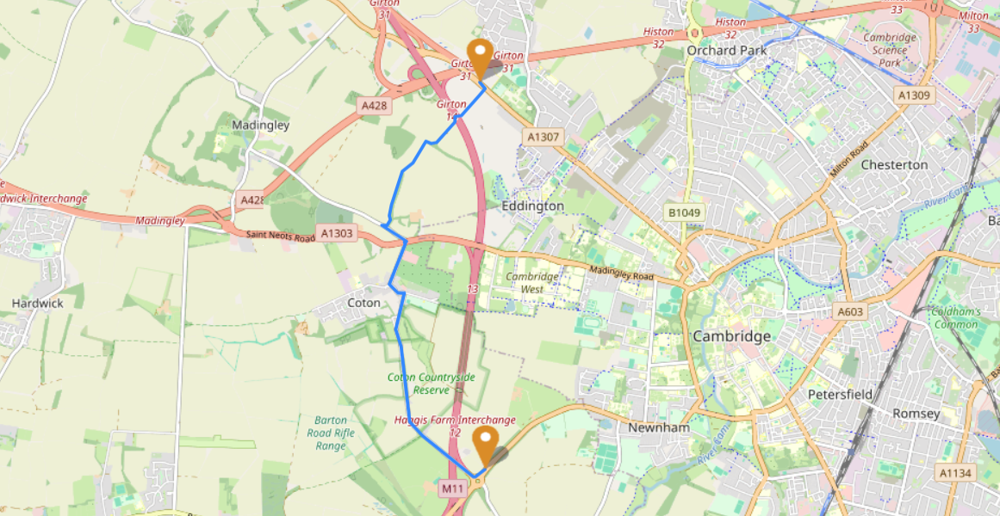
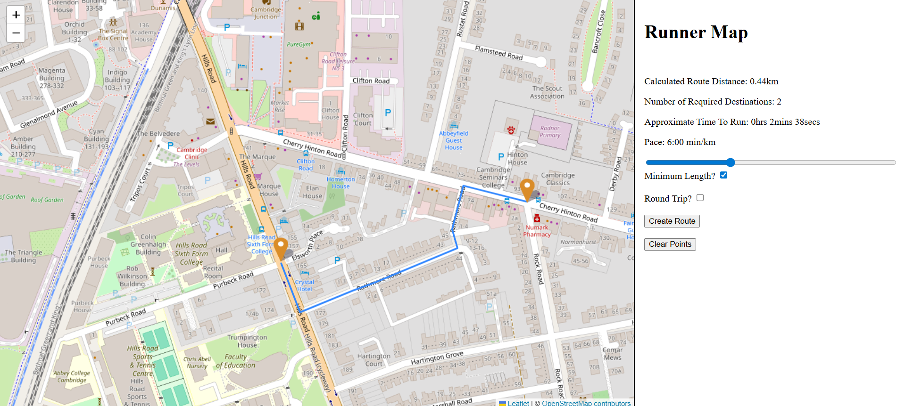

# Runner Map

## Overview

Runner Map is a website which allows for users to create running routes by plotting points on a map. These routes can either be as short as possible or target a specific route length, as needed by the user. The user is also able to adjust their pace and decide if the route needs to be round trip. The program tells the user the route's length, the time taken to run the route (based on the pace entered) and the number of destinations that the user has asked the program to go to.

I originally created this program as part of my computer science NEA but it has since been updated and improved.

Runner Map has been designed for Google Chrome. The code sticks to widely used brower features however I cannot garuntee functionality or the absence of unexpected errors when using other browsers.
## Dependencies

Runner Map includes the following dependencies:
* Osmium                (https://github.com/osmcode/libosmium)
* Zlib                  (https://github.com/madler/zlib) 
    * Pre built version for windows x64 (https://github.com/OSDVF/zlib-win-x64)
* Protozero             (https://github.com/mapbox/protozero)
* Leaflet               (https://github.com/Leaflet/Leaflet)
    *Leaflet Arrowheads (https://github.com/slutske22/leaflet-arrowheads)   
* NodeJS                (https://nodejs.org/en)
    * Node-API          (https://nodejs.org/api/n-api.html)
* Express               (https://expressjs.com/)
* gpx-parser-builder    (https://github.com/kf99916/gpx-parser-builder)
* fast-xml-parser       (https://github.com/NaturalIntelligence/fast-xml-parser)
* CMake-js
* Nodemon (Dev only) 

Runner Map also uses the open meteo elevation API. Link: https://open-meteo.com/en/docs/elevation-api
This API uses elevation data from the Copernicus DEM 2021 release GLO-90.

## How To Set Up For Development
* First, fork the repository and clone it onto your local device (We'll call this folder runnermap/ in these instructions)
* Download the osmium library and protozero repositories from the link above and add them to the directories runnermap/include/osmium and runnermap/include/protozero respectively
* If you are using a windows x64 machine, download the pre built version of zlib from the link above and add it to the directory runnermap/zlib
    * If you are not using a windows x64 machine, you will need to download zlib from source (the other link above) and build it yourself. Add this to the same location described above
* Download NodeJS on your computer
* Use npm to install leaflet, browserify, cmake-js, nodemon, leaflet arrowheads, gpx-parser-builder, fast-xml-parser and express (npm install {dependency_name})
* Run the following commands: 
```
npm run buildJvs
```
```
npm run build
```
* These commands build the javascript file and the runnermap library respectively
* Finally, run the following command to host a runnermap server
```
npm run start
```
* Visit http://localhost:3000/ to see the hosted website 
* (Note: if you wish to change the port this can be done by changing the number passed as a param to app.listen on the last line of the server.js file)


* The following command can be used to build the runnermap library in debug mode:
```
npm run buildDebug
```

## Screenshots

Screenshot showing a generated route:




Screenshot showing the UI for the program:



